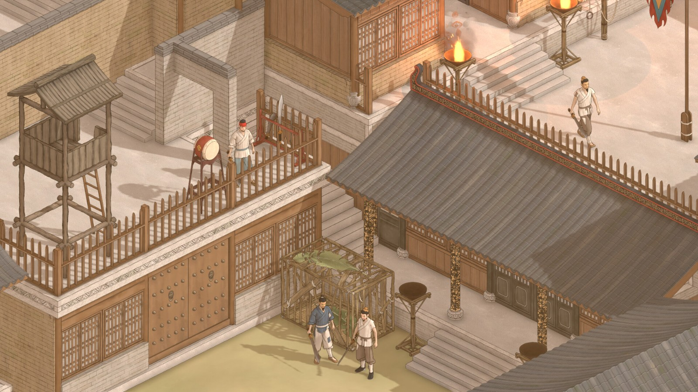

# 古建筑测绘游戏设计总体构想

## 1. 游戏主线
游戏发生在一个基于中国到印度和东南亚地区现实、构建的**架空大陆**上。玩家将扮演一名**考古 or 建筑学博士生**，走访各地的古建筑，完成科研，保护，招投标等任务。
* **核心任务**：在游戏中完成测绘资料和保护任务，申报课题，发表研究成果。
* **成长路径**：赚取研究点数和科研资金，升级自己的技能、实验室，购买设备，招募人员。
* **最终目标**：获取更高的资质以完成规模更大、奖励更丰富的任务。
* **剧情探索**：在一步步的探索中揭秘建筑背后不为人知的传说和故事……
* **游戏卖点**：在过程中玩家可以浏览根据真实历史建筑建模的精致模型，探索不同的地形和自然环境，体验建筑遗产保护工作流程。除了建筑主线故事之外，玩家还可运营自己的实验室，申报课题，压榨手下的硕士生。参与触发的随机事件和隐藏事件（驱赶动物，帮村民航空吊运，送的扶贫猪仔下午就被村民烤来吃了，想要当皇帝的人等等...），吃学校里老师学生男女关系的八卦，在任务系统里面体验招投标过程中的不合理低价，暗箱操作和其它操蛋事情...

## 2. 玩法设想
* **基础资源**：
  * 时间：需要消耗时间在地图上进行机动，升级设备，进行工作，刷新任务列表，完成各种任务等。
  * 红纸：游戏最通用的基础货币，购买升级任务常用的道具装备等，如食物，测绘设备，交通费用。
  * 蓝纸：游戏高级货币，购买升级实验室设备，比如显微镜，实验器材，药品等。可以使用红纸以一定比例转化，需要收取手续费。
  * 黄金：特殊货币，主要用于任务或者npc交互场景，和购买唯一的特殊物品。黄金可以通过红蓝纸购买，也能在在任务和探索地图的时候获得。
  * 科研点数：通过完成科研任务获取，用以升级个人技能，实验室人员（硕士生），实验室等级等.
* **经营管理**：
    * 通过完成分配的外业调研任务获取资金和科研点数。
    * 管理和升级实验室以获取资质（如在具备某些设备，完成一定的任务量后，可以升级甲、乙、丙级测绘、勘测、建筑）。
    * 承接更多更高级的测绘任务，申报更高级的课题（省级、国家、国自然……）。
    * 升级个人技能以完成任务和使用不同装备（如飞手证，建造师，测绘证书等）。
* **核心行为**：玩家控制人物在场景中交易、与 NPC（村民、市民、领导、老师、自己名下的硕士生）交互、寻找线索，完成任务目标，开启不同的故事线。
* **游戏场景分类**：
    * 地图场景
      纵览整个世界的地图，消耗时间金钱在不同地点之间机动。
    * 中间场景
      城市村庄学校等场景，在地图中进入某个地点后，进入任务场景前出现，2.5D或者3D场景，可以购买一些消耗品和简单任务装备，可以触发npc任务。
    * 任务场景
      2.5D或者3D场景，在进入任务场景后进行任务内容和探索主线。
    * 实验室场景
      在这里消耗时间进行科研任务，内业处理任务，招募人员，购买维修升级大型昂贵的任务装备或者实验室设备
      
## 3. 角色属性
### 角色属性
* **基础数值**：体力、负重、职业资格、精神状态（SAN 值）。
### 角色装备（装备系统设定）
* **装备**：分服饰和装备，不同服饰提供属性加成。
* **交通工具**：不同的车辆，不同车辆能带不同数量的任务物品
* **平台**：载具。
* **服饰**：功能性外装。

## 4. 任务系统
### 任务与游戏推进  
任务分为主线与日常，主线可以

### 任务承接方式
* **课题申报**：通过申报操作后承接。
* **投标**：通过招投标操作承接。
* **日常**：固定的科研任务。
* **日常**：固定的科研任务。
### 任务类型与奖励
1.  **科研**：一般自动生成，内容通常是测绘。不完成会有惩罚（扣除“红纸”）。
2.  **课题**：主要返回“资金”和“研究点数”。
3.  **招投标**：主要返回“资金”，数额在“投标”过程中由玩家决定。
4.  **特殊任务**：任务途中与 NPC 互动触发（例如 NPC 看中你的属性后发布的委托），返回“资金”等奖励。
### 任务环境约束
* **时间与天气**：任务需要消耗时间，特定任务只能在特定时间完成。天气会制约测绘方式的使用。

## 5. 核心测绘玩法与关卡设计
对民居、寺院、书院、宫殿、桥梁、牌坊、陵墓等进行测绘、修复、重建。
* **建筑状态**：完整、不同程度受损、废墟状态。
* **测绘流程**：进入任务后，建筑模型变为半透明状。

### 测绘方式对比(有待补充)
| 测绘方法 | 玩家操作与消耗(时间) | 视觉/产出效果 |
| :--- | :--- | :--- |
| **纸笔卷尺** | 需跑遍建筑画草图，控制人物按轴网跑动攀爬，耗时最长。 | 测绘完成区块变为**手绘风格**。 |
| **全站仪** | 设立控制点，粘贴反光牌，人物移动较少。 | 成果变为**CAD 风格**。 |
| **摄影测量** | 需飞无人机。 | 输出**带材质的Mesh网格**。 |
| **激光扫描** | 需架站和拼站。 | 输出**点云效果**。 |

### 环境约束示例
* 摄影测量：只能在白天进行。
* 三维激光：无法在雾天使用。
* RTK：无法在林下使用。
* 无人机：有续航限制，需要充电  
(*诸如此类...*)  

* **收集与升级**：玩家逐个完成网格工作，测绘完成一个网格时，获取“回款”和“研究点数”，并且有一些随机掉落物。在整个建筑测绘完成后可以点亮并解锁图鉴系统，
* **技术更替**：游戏前期只能进行手工测绘，后期升级全站仪、无人机、SLAM 等装备后，可重新测绘以获取更多点数。

## 6. 设计工作
* **游戏流程设想**:

* **美术风格**：
工笔画，模仿烽火与炊烟。根据不同地图场景，使用不同配色氛围（比如在中国用古建配色，印度，东南亚用不同区域的传统/大地色系）。（设定集仍在设想中） 

## 7. 剧本  
多结局故事，主角需要通过揭秘，升级，推进科研进度等达成不同结局  

* **人物**  
1.主角  
苦逼27岁建筑学博士生，要帮老板打理实验室。
2.主线人物  
包含自己的老板，主线任务中的甲方，主线其它人物等。  
3.支线人物  
支线人物中的各类人物，触发支线任务。  
4.雇员  
实验室里面的招募人员（硕士生，外包，老板亲戚等...），可以与主线支线人物共用。  
5.普通npc  
路人，商店老板等。    

| 人物 | 角色设定 | 人物作用 |
| :--- | :--- | :--- | 
| **老板** | 工程院院士，主角的导师，老头子老资格 | 发钱，发科研点数，提供与推进任务，提供情报 |
| **待补充** | 待补充 | 待补充 |
| **待补充** | 待补充 | 待补充 |

* **地点**

* **场景** 

* **章节与故事** 
